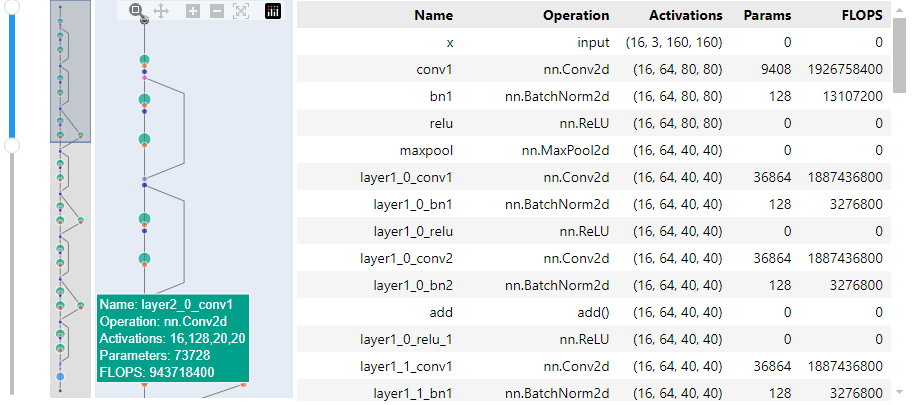
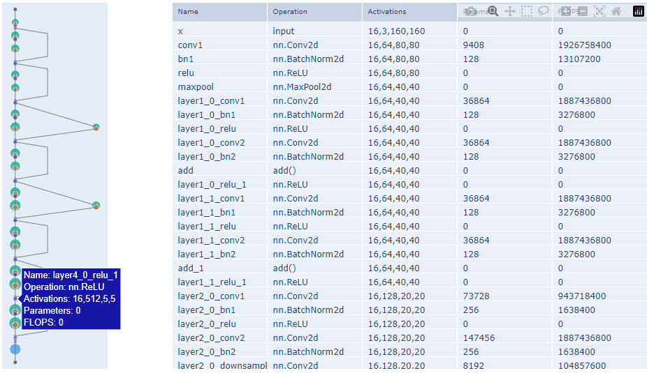
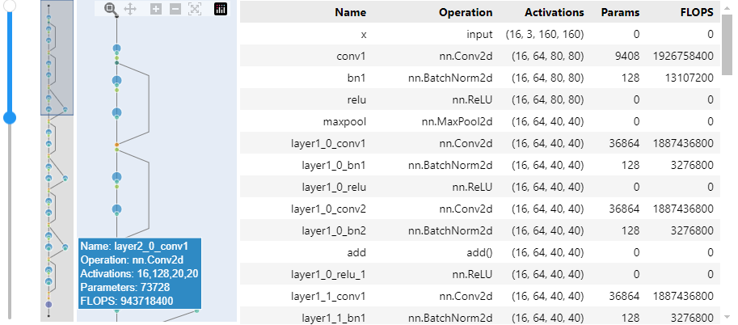
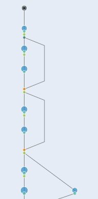

# IDLMAV
Interactive deep learning model architecture visualization (IDLMAV) is a tool that creates interactive visualizations of model architectures for display in Jupyter notebooks.
* It does not require a successful forward pass: it can also visualize partial models
* It produces three outputs to allow trading off interactivity for portability
  - An interactive widget with synchronized scrolling and interactions between sub-plots
  - A figure that still has some interactivity, but displays correctly without the need of a running backend/kernel, e.g. in [nbviewer](https://nbviewer.org/)
  - Export to a standalone HTML file

# Installation

```
pip install git+https://github.com/d112358/idlmav.git
```

# Usage examples
## Analyzing the model
```python
import torch, torchvision
from idlmav import MAV, plotly_renderer
device = 'cpu'
model = torchvision.models.resnet18().to(device)
x = torch.randn(16,3,160,160).to(device)
mav = MAV(model, x, device=device)
```

## Interactive graph (go.FigureWidget)
```python
with plotly_renderer('notebook_connected'):
    mav.show_widget(add_overview=True)  
```


## Release mode graph (go.Figure)
```python
with plotly_renderer('notebook_connected'):
    mav.show_figure(add_slider=True)
```


## Specifying colors
* See [Palette options](https://plotly.com/python/discrete-color/#color-sequences-in-plotly-express)
* The keys to `fixed_color_map` may be a mixture of strings in the **Operation** column and categories as listed [here](https://pytorch.org/docs/stable/nn.html)
```python
with plotly_renderer('notebook_connected'):
    mav.show_widget(
        palette='Vivid',
        avoid_palette_idxs=set([10]),
        fixed_color_map={'Convolution':7, 'add()':0, 'nn.MaxPool2d':5}
    )
```


## Adding and removing panels
```python
with plotly_renderer('notebook_connected'):
    mav.show_widget(add_overview=False, add_slider=False, add_table=False)    
```


## Exporting to HTML
```python
mav.export_html('resnet18.html')
```

# Use cases
* Iteratively designing a model and viewing activations, parameter counts and FLOPS "so far" before the whole model has been defined
* Document a model in a notebook and generate the architecture in such a way that it is viewable on [nbviewer](https://nbviewer.org/) without a running kernel
* Analyze 3rd party models when importing them into a notebook
* Scan a model for potential places to save parameters or FLOPS

# Features
* Works on incomplete models and models without a successful forward pass
* Can provide an interactive plot that does not require a running kernel
* Customizable color palette and node or category color mappings
* Graph interactions (interactive graph)
  - Hover over modules to see activation sizes, number of parameters and FLOPS
  - Synchronized scrolling between table and graph
  - Clicking on a module highlights that module in the table
  - Clickable overview window showing full model
  - Range slider from ipywidgets with synchronized pan and zoom functionality
  - Synchronization with Plotly's built-in pan and zoom functionality
* Graph interactions (release graph)
  - Hover over modules to see activation sizes, number of parameters and FLOPS
  - Scrollable table (not synchronized)
  - Horizontal slider provided by Plotly (not synchronized)
  - Pan and zoom provided by Plotly (not synchronized)

# Limitations
* Inherited [limitations of symbolic tracing](https://pytorch.org/docs/stable/fx.html#limitations-of-symbolic-tracing) from torch.fx
  - Dynamic control flow
  - Non-torch functions
* Inherited from ipywidgets:
  - Interactive graph requires a running kernel to dynamically create DOM elements
  - Release graph has no synchronization between panels
* Inherited from plotly
  - Release graph can only support a horizontal slider
* Environment-specific limitations
  - Kaggle currently (Dec 2024) seems to have trouble displaying `go.FigureWidget`, so only the release mode graph is available there

# Planned updates
* Make the primary direction (down/right/up/left) configurable
* Allow the user to specify a latent node at which the graph changes direction (e.g. for autoencoder / UNet architectures)
* Add drop-down boxes to dynamically toggle between coloring and sizing modes (e.g. color by node operation, number of parameters, FLOPS)

# License
This repository is released under the MIT license. See [LICENSE](LICENSE) for additional details.
